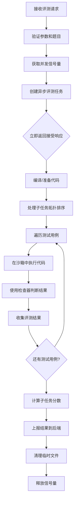

# 评测流程

本文档详细描述 SEU AIJ Judge-Endpoint 的代码评测流程，从接收提交请求到返回评测结果的完整过程。

## 总体流程



## 详细步骤

### 1. 接收评测请求

**入口**: `POST /judge/submission`

**请求参数**:
```json
{
    "submissionId": "sub_123456",
    "pid": "p01",
    "code": "#include <stdio.h>\nint main() {...}",
    "language": "Cpp"
}
```

**验证步骤**:
1. 解析 JSON 请求体
2. 验证必填字段存在
3. 验证语言类型在支持列表中
4. 验证题目 ID 对应的目录存在

### 2. 异步任务创建

**关键决策**: 评测是异步进行的，服务立即返回接受响应，实际评测在后台进行。

**原因**:
- 评测可能耗时较长（编译、执行多个测试用例）
- 避免 HTTP 连接超时
- 支持并发评测多个提交

**代码位置**: `src/server/judge_problem_by_id.rs`

```rust
tokio::spawn(async move {
    // 异步评测逻辑
});
```

### 3. 并发控制

**机制**: 使用 `tokio::sync::Semaphore` 限制最大并发评测数。

**配置**: `AIJ_MAX_CONCURRENT_REQUESTS`（默认 6）

**代码位置**: `src/server.rs`
```rust
static JUDGE_SEMAPHORE: OnceLock<Semaphore> = OnceLock::new();
```

**工作流程**:
1. 尝试获取信号量许可
2. 如果达到最大并发数，等待直到有可用许可
3. 评测完成后释放许可

### 4. 加载题目配置

**文件读取**:
1. `{problems_dir}/{pid}/problem.json` → `ProblemMetadata`
2. `{problems_dir}/{pid}/info.toml` → `ProblemConfig`

**配置解析**:
- 使用 `serde_json` 解析 JSON
- 使用 `toml` 解析 TOML
- 验证配置完整性和有效性

**关键检查**:
- 测试用例列表不能为空
- 问题类型和检查器类型匹配
- 子任务无循环依赖

### 5. 代码编译与准备

根据编程语言类型采取不同策略：

#### 编译型语言（C, C++, Go, Java）

**流程**:
1. 将代码保存到临时文件
2. 调用编译器编译代码
3. 检查编译错误
4. 生成可执行文件

**示例（C++）**:
```rust
let gpp = AijConfig::get_binary_path("g++").await?;
let compile_output = Command::new(gpp)
    .arg(&source_file_path)
    .arg("-o")
    .arg(&exec_path)
    .output()
    .await?;
```

#### 解释型语言（Python, Node.js）

**流程**:
1. 将代码保存到临时文件
2. 准备解释器命令
3. 调整时间限制（通常加倍）

**示例（Python）**:
```rust
let python3 = AijConfig::get_binary_path("python3").await?;
problem_config.problem_info.time_limit_ms *= 2; // 时间限制加倍
```

#### 语言特定处理

| 语言 | 编译器/解释器 | 时间限制系数 | 内存限制系数 | 沙箱规则 |
|------|--------------|-------------|-------------|----------|
| C | gcc | 1.0 | 1.0 | CCpp |
| C++ | g++ | 1.0 | 1.0 | CCpp |
| Python 3.12 | python3 | 2.0 | 1.0 | Python |
| Node.js 22 | node | 2.0 | 1.0 | Node |
| Go 1.22 | go | 1.0 | 2.0 | Golang |
| Java 17 | javac/java | 2.0 | 1.0 | Java |

### 6. 子任务处理

#### 子任务拓扑排序

**算法**: Kahn 算法（拓扑排序）

**目的**: 确定子任务的执行顺序，处理依赖关系。

**代码位置**: `src/judger/utils.rs::get_topo_order()`

**输入**: 子任务列表，包含 `pre_subtasks` 依赖关系

**输出**: 子任务 ID 的拓扑排序列表

**循环依赖检测**: 如果排序结果包含的子任务数量不等于总数，说明存在循环依赖。

#### 子任务评分策略

**两种评分类型**:
1. `"min"`: 取子任务中所有测试用例得分的最小值
2. `"sum"`: 取子任务中所有测试用例得分的平均值

**计算公式**:
```rust
// min 类型
let min_score = scores.into_iter().min().unwrap_or(0);
subtask_config.score = ((min_score * subtask_config.score) as f64 / 100.0) as i32;

// sum 类型
let avg_score: f64 = scores.into_iter().sum::<i32>() as f64 / scores.len() as f64;
subtask_config.score = ((avg_score * subtask_config.score as f64) / 100.0) as i32;
```

#### 依赖关系处理

**规则**:
1. 如果子任务 A 依赖于子任务 B，则 B 必须在 A 之前评测
2. 如果依赖的子任务中有任何错误（非 Accepted），当前子任务的所有测试用例被标记为 `Skipped`
3. 跳过测试用例不计分，也不影响后续评测

### 7. 测试用例执行

#### 执行环境配置

**沙箱配置** (`judger::Config`):
```rust
Config {
    max_cpu_time: time_limit_ms,      // CPU 时间限制
    max_real_time: time_limit_ms * 2, // 实际时间限制
    max_memory: memory_limit_kb * 1024, // 内存限制（字节）
    max_stack: memory_limit_kb * 1024,  // 栈大小限制
    max_process_number: 1,            // 最大进程数
    max_output_size: memory_limit_kb * 1024, // 输出大小限制
    exe_path: exec_path,              // 可执行文件路径
    args: args,                       // 参数列表
    input_path: input_path,           // 输入文件路径
    output_path: output_path,         // 输出文件路径
    error_path: error_path,           // 错误输出路径
    seccomp_rule_name: Some(seccomp_rule), // 沙箱规则
    ..Default::default()
}
```

#### 沙箱执行

**调用**: `judger::run(&config, interactor)`

**参数**:
- `config`: 沙箱配置
- `interactor`: 交互器路径（仅交互题需要）

**返回**: `judger::Result` 包含执行结果和资源使用情况。

#### 执行结果处理

**可能的错误码** (`judger::ErrorCode`):
- `Success`: 执行成功
- `WrongAnswer`: 答案错误（交互题）
- `CpuTimeLimitExceeded`: CPU 时间超限
- `RealTimeLimitExceeded`: 实际时间超限
- `MemoryLimitExceeded`: 内存超限
- `RuntimeError`: 运行时错误
- `SystemError`: 系统错误

### 8. 结果检查

根据题目类型使用不同的检查器：

#### 标准检查器 (`CheckerType::Standard`)

**逻辑**: 逐行比较用户输出和答案文件，忽略行尾空白和末尾空行。

**代码位置**: `src/judger/checker/standard.rs`

**比较步骤**:
1. 规范化输出和答案（去除末尾空行，修剪行尾空白）
2. 按行分割
3. 逐行比较
4. 如果完全相同 → `Accepted`
5. 如果不同 → `WrongAnswer`，指出第一个不同的行

#### 特殊检查器 (`CheckerType::Special`)

**执行**: 调用外部检查器程序。

**接口**:
```bash
./checker <input_file> <output_file> <answer_file>
```

**返回值解析**:
- 退出码 `0` → `Accepted`
- 退出码 `7` → `PartiallyAccepted`（部分正确）
  - stderr 格式: `points <分数> <消息>`
  - 分数范围: 0.0 - 1.0
- 其他退出码 → `WrongAnswer`，stderr 作为错误消息

**代码位置**: `src/judger/checker/special.rs`

#### 交互检查器 (`CheckerType::Interactor`)

**处理**: 在沙箱执行阶段已由交互器处理，此处无需额外检查。

**交互器接口**:
```bash
./interactor <input_file> <output_file>
```

**结果**: 交互器正常退出则认为 `Accepted`，否则 `WrongAnswer`。

### 9. 结果收集

#### 单个测试用例结果

```rust
struct JudgeResultItem {
    id: i32,           // 测试用例 ID
    time: i32,         // CPU 时间使用（毫秒）
    mem: i64,          // 内存使用（字节）
    sys: String,       // 系统输出信息
    r#in: String,      // 输入内容（截断后）
    ans: String,       // 答案内容（截断后）
    out: String,       // 用户输出（截断后）
    r#type: String,    // 结果类型
    score: i32,        // 得分（0-100）
}
```

#### 输出截断

**配置**: `AIJ_OUTPUT_TRUNCATE_LENGTH`（默认 200）

**目的**: 避免过大的输出数据占用内存和网络带宽。

**实现**: 使用 `get_text_by_path(path, Some(truncate_len))` 读取文件时指定最大长度。

### 10. 分数计算

#### 权重计算（无子任务时）

**公式**:
```
测试用例得分 = 原始得分 × (测试用例权重 / 总权重)
```

**代码**:
```rust
let sum_weight: f64 = problem_config.testcases.iter().map(|s| s.weight).sum();
res.score = (res.score as f64 * case_config.weight / sum_weight) as i32;
```

#### 子任务分数计算

已在第6步处理，最终子任务分数会更新到 `SubtaskConfig.score` 字段。

### 11. 结果上报

#### 上报接口

**URL**: `http://{backend_host}:{backend_port}{backend_prefix}/judge/submission/{submissionId}`

**方法**: `PUT`

**内容类型**: `application/json`

#### 上报内容

**成功评测**:
```json
{
    "status": "Success",
    "resultDetail": [...],  // JudgeResultItem 列表
    "subtasks": [...]       // 更新后的 SubtaskConfig 列表
}
```

**编译错误**:
```json
{
    "status": "CompileError",
    "errorDetail": "编译错误信息"
}
```

**评测错误**:
```json
{
    "status": "JudgendError",
    "errorDetail": "评测错误信息"
}
```

#### 错误处理

- 如果上报失败，记录警告日志但不影响评测结果
- 使用 `reqwest::Client` 发送 HTTP 请求
- 超时和重试策略使用默认配置

### 12. 资源清理

#### 临时文件管理

**临时目录结构**:
```
{submissions_dir}/{submission_id}/
├── Main.cpp          # 源代码文件
├── executable        # 可执行文件（编译型语言）
├── 1.out             # 测试用例1输出
├── 1.err             # 测试用例1错误输出
├── 1.log             # 测试用例1日志
└── ...
```

**清理策略**:
- 如果 `AIJ_SAVE_SUBMISSIONS = true`: 保留临时文件
- 如果 `AIJ_SAVE_SUBMISSIONS = false`: 删除整个提交目录

**删除操作**: `delete_dir_by_submission_id(&submission_id).await`

#### 信号量释放

评测完成后自动释放信号量许可，允许其他评测请求进行。

## 错误处理

### 编译错误

**检测**: 编译器退出码非零

**处理**: 立即返回 `JudgeResult::CompileError`，包含编译器错误信息

**结果上报**: `{"status": "CompileError", "errorDetail": "..."}`

### 沙箱执行错误

**类型**: 时间超限、内存超限、运行时错误等

**处理**: 记录错误类型，继续执行其他测试用例

**结果**: 测试用例标记为对应错误类型，得分为0

### 系统错误

**类型**: 文件不存在、权限错误、配置错误等

**处理**: 返回 `AijError::Judge` 错误

**结果上报**: `{"status": "JudgendError", "errorDetail": "..."}`

### 检查器错误

**类型**: 检查器执行失败、格式错误等

**处理**: 标记为 `WrongAnswer`，使用检查器错误信息

## 性能优化

### 并发处理

- 使用异步 I/O 避免线程阻塞
- 信号量控制并发数，防止资源耗尽
- 评测任务在独立 Tokio 任务中执行

### 资源复用

- 二进制工具路径缓存，避免重复查找
- 配置单例，避免重复加载
- 连接池管理 HTTP 客户端

### 内存管理

- 输出截断，避免大文件内存占用
- 及时清理临时文件
- 使用流式处理大文件

## 监控和日志

### 关键日志点

1. **请求接收**: 记录提交 ID、题目 ID、语言
2. **编译开始/结束**: 记录编译时间和结果
3. **测试用例执行**: 记录每个测试用例的执行结果
4. **结果上报**: 记录上报状态和响应
5. **错误事件**: 记录所有错误详情

### 性能指标

- 评测请求处理时间
- 编译时间
- 测试用例执行时间
- 内存使用峰值
- 并发评测数

## 安全考虑

### 代码安全

- 沙箱隔离用户代码
- 资源限制（时间、内存、进程数）
- 系统调用过滤（seccomp）

### 文件安全

- 文件名验证，防止路径遍历
- 文件权限控制
- 临时文件隔离

### 网络安全

- 输入验证和过滤
- 请求大小限制
- 并发连接限制

## 扩展性

### 添加新语言

1. 在 `SupportedLanguages` 枚举中添加变体
2. 在 `judge` 函数中添加对应的编译/执行逻辑
3. 更新 `AIJ_TOOLCHAINS` 环境变量
4. 添加对应的 seccomp 规则（如果需要）

### 添加新检查器

1. 在 `CheckerType` 枚举中添加变体
2. 在 `checker` 模块中添加实现
3. 更新类型匹配规则

### 自定义评分策略

可以通过扩展 `SubtaskConfig` 的 `type` 字段和支持新的评分算法来实现。